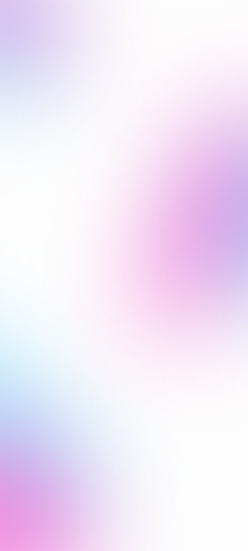

# DevLinks

Este é um projeto HTML básico que exibe links para várias redes sociais. O projeto possui um recurso de alternância entre o modo claro e o modo escuro, que também altera a imagem do perfil.

## Pré-requisitos

- Navegador da web

## Como usar

1. Clone este repositório em sua máquina local.
2. Abra o arquivo `index.html` em seu navegador da web.
3. Clique no botão de alternância com símbolo de lua ou de sol para alternar os modos LIGHT(claro) ou DARK(escuro) abaixo da foto de perfil.
4. Explore os diferentes links para acessar as redes sociais.
   (links desativados para edições pessoais e testes)

## Tecnologias utilizadas

- HTML
- CSS
- JavaScript
- Git e Github
- Figma Rocketeats

## Screenshots

## Agradecimentos

Este projeto foi inspirado e desenvolvido como parte de um curso oferecido pela Rocketseat. Agradeço à Rocketseat por fornecer o conhecimento necessário para criar este projeto.

Para obter mais informações sobre a Rocketseat, visite o [site oficial](https://rocketseat.com.br/).

## Autor

4ndrev.

## Licença

Este projeto não possui marca e direitos autorais e está sob a Licença de[Rocketseats]. Consulte o arquivo LICENSE.md para obter mais informações.
